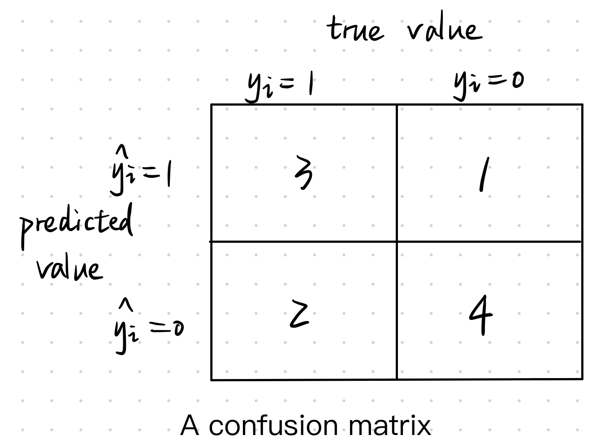
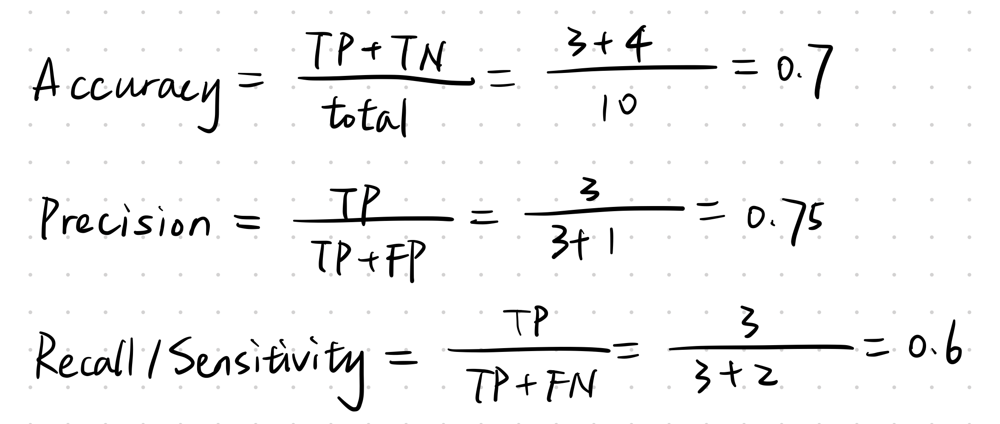
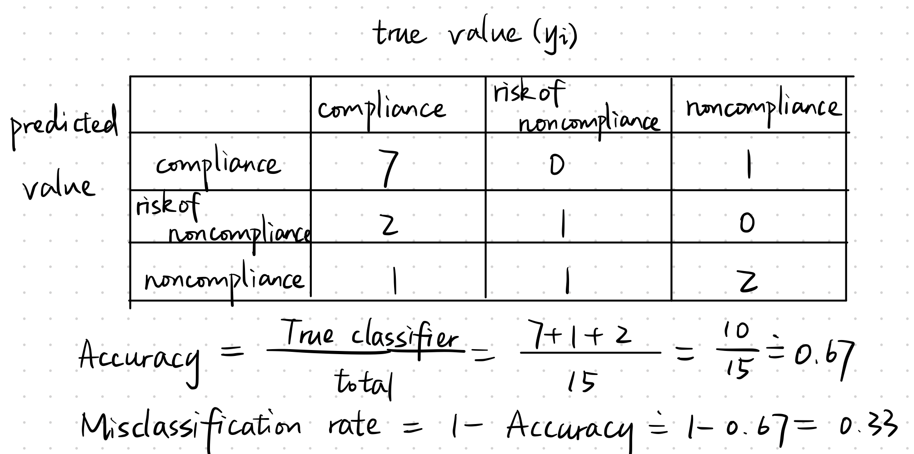
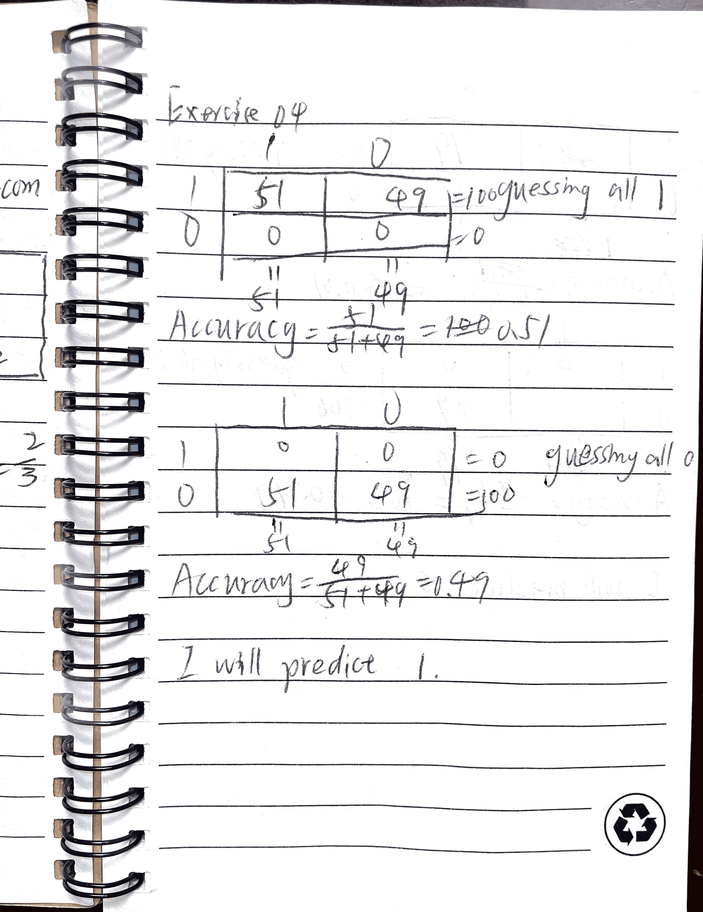
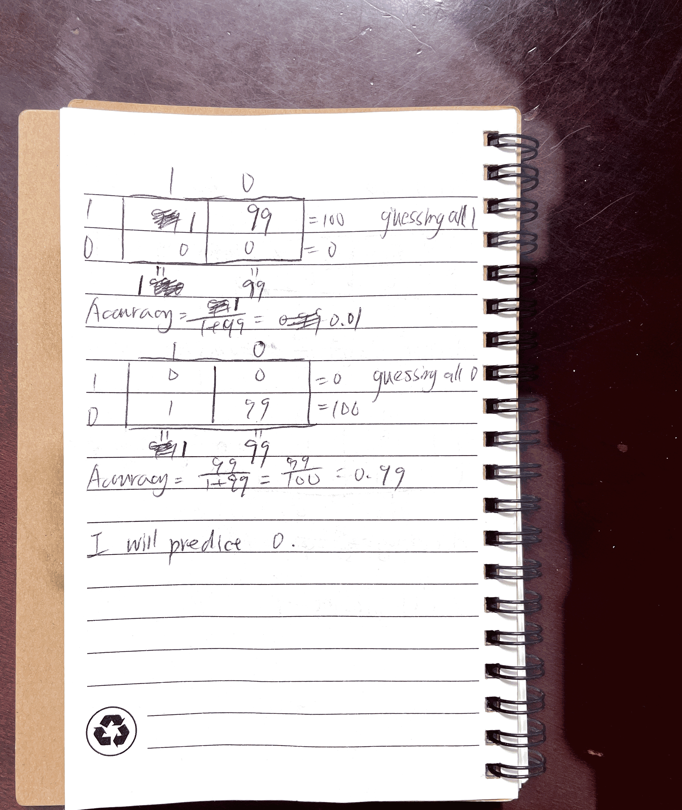
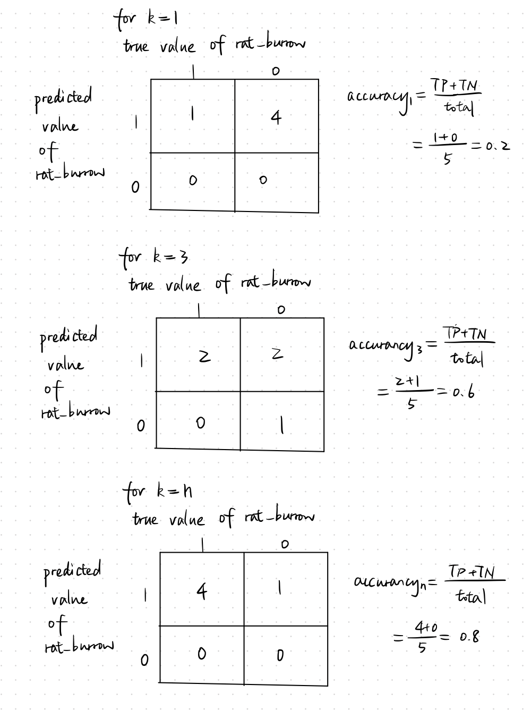

```{r setup, include=FALSE}
knitr::opts_chunk$set(echo = TRUE)
```

# library all packages needed
```{r library packages}
library(dplyr)
library(rsample)
library(parsnip)
library(recipes)
library(workflows)
library(tune)
library(yardstick)
library(readr)
library(ggplot2)
library(purrr)
library(rpart)
```

# Exercise 01
```{r Exercise 01}
#To calculate MSE, RMSE, MAE by hand and display the work
knitr::include_graphics("Exercise01.png")
```

As it shows, MSE = 4.4, RMSE = 2.10 (approximately), MAE = 1.6.
RMSE, whose value is larger than MAE, intensified the effect of outliers by taking the square of each difference, while MAE only calculate each absolute value equally. For example, 


# Exercise 02
```{r Exercise 02}
#Using the above data, calculate the following “by hand” and show your work.


```
The value of accuracy, precision and recall/sensitivity is shown as above.

# Exercise 03
```{r Exercise 03}
#using the data, calculate the following “by hand” and show your work

```

The value of accuracy, misclassification rate is shown as above.

# Exercise 04
```{r Exercise 04}
#to draw the confusion matrix, assume that there are in all 100 observations in the population.
#for the first circumstance, we can either choose to guess everything is 1, or everthing is 0, and the corresponding accuracy for each approach is:

```
If we guess all 1, the accuracy is 0.51; If we guess all 0, the accuracy is 0.49; we chose to guess 1 for all values. 

```{r Exercise 04}
#for the first circumstance, we can either choose to guess everything is 1, or everthing is 0, and the corresponding accuracy for each approach is:

```
If we guess all 1, the accuracy is 0.01; If we guess all 0, the accuracy is 0.99; we chose to guess 0 for all values. 

Considering context might reverse our decision that is only based on accuracy. For example, in the situation 2 above, if we predcit all 1, we get accuracy= 0.01, if we predict all 0, we get accuracy=0.99, so we chose to predict all 0. However, if the context is cancer screening:  predicting all 1, we get a lot of false positive but no false negative;  predicting all 0, we get no false positive but some false negative. In the context of cancer screening, false negative means that people who have cancern are not getting treated, and false positive means that people who do have cancern are getting more testing. The cost of false negative is greater than false positive. As such, we want to avoid false negative. In this context, we will choose to predict all 1 rather than predicting all 0. As we can see, considering the context can potentially reverses our original decision based on accuracy. 


# Exercise 05
## Q1
```{r}
marbles_split <- initial_split(data=marbles,prop=0.8)
marbles_split_train <- training(x=marbles_split)
marbles_split_test <- testing(x=marbles_split)
```

## Q2
```{r}
marbles_split_train %>%
  group_by(size,color)%>%
  count()%>%
  ggplot(aes(x=size,y=n,fill=color))+
  geom_bar(stat="identity",position="fill")
```
When we get a big marble, it is more likely it is a black marble, so we will predict it to be black; 
When we get a small marble, it is more likely it is a white marble, so we will predict it to be white.

## Q3
```{r}
prediction <- function(x){
  if_else(x=="big", "black", "white")
}
marbles_split_test$pred_color = factor(prediction(marbles_split_test$size))
marbles_split_test$pred_color
```

## Q4
```{r}
accuracy_confusion <- function(x,y){
  table <- table(x,y)
  table_tibble <- as_tibble(table(x,y))
  accuracy <- (table_tibble[[1,3]]+table_tibble[[4,3]])/sum(table_tibble[,3])
  return(list(accuracy,table))
}
accuracy_confusion(marbles_split_test$color,marbles_split_test$pred_color)
```
## Q5
```{r}
cart_rec <- 
  recipe (formula = color ~ size, data = marbles_split_train)

cart_mod <- 
  decision_tree() %>% 
  set_engine(engine = "rpart") %>% 
  set_mode(mode = "classification")

cart_wf <- 
  workflow() %>% 
  add_recipe(cart_rec) %>%
  add_model(cart_mod)

cart_fit <- 
  cart_wf %>% 
  fit(data = marbles_split_train)
rpart.plot::rpart.plot(x = cart_fit$fit$fit$fit)
```

## Q6
```{r}
Step5 <- predict(object = cart_fit, new_data = marbles_split_test)
identical(marbles_split_test$pred_color, Step5$.pred_class)
```
The decision tree/CART model and the model from part 2 generated the same predictions. These two models have the same outcomes because they use the same underlying rule: for a binary outcome, if the probability of an event occuring exceeds a threshold, then the model predit that event, and the thresholds are set to be 0.5 in both models. 

# Stretch Part 01
```{r Stretch Part01}
set.seed(20200302)
# input the data
rats <- tribble(~rat_burrow, ~pizza_proximity,
  1, 0.01,
  1, 0.05,
  1, 0.08,
  0, 0.1,
  0, 0.12,
  1, 0.2,
  1, 0.3,
  1, 0.5,
  1, 0.75,
  0, 0.9,
  1, 1,
  0, 1.2,
  0, 2.2,
  0, 2.3,
  0, 2.5,
  1, 3,
  0, 3.5,
  0, 4,
  0, 5,
  0, 7
) %>%
 mutate(rat_burrow = factor(rat_burrow))

# split into training and testing data
split <- initial_split(rats, prop = 0.75)
rats_training <- training(split)
rats_testing <- testing(split)
rats_k1 <- vfold_cv(data = rats_training,
                    v = 3)
rats_k3 <- vfold_cv(data = rats_training,
                    v = 3)
rats_kn <- vfold_cv(data = rats_training,
                    v = 3)
#Extract the analysis data and assessment data from the first resample in rats_k1, rats_k3, and rats_kn.
analysis_k1 <- rats_k1$splits[[1]] %>% analysis()
assess_k1 <- rats_k1$splits[[1]] %>% assessment()
analysis_k3 <- rats_k3$splits[[1]] %>% analysis()
assess_k3 <- rats_k3$splits[[1]] %>% assessment()
analysis_kn <- rats_kn$splits[[1]] %>% analysis()
assess_kn <- rats_kn$splits[[1]] %>% assessment()
#calculate y_hat for each assessment data
#for k = 1
# (1) create a knn model specification
knn_mod_k1 <-
  nearest_neighbor(neighbors = 1) %>%
  set_engine(engine = "kknn") %>%
  set_mode(mode = "classification")
# (2) fit the knn model specification on the training data
knn_fit_k1 <- knn_mod_k1 %>%
  fit(formula = rat_burrow ~ pizza_proximity, data = analysis_k1)
# (3) use the estimated model to predict values in the testing data
prediction_k1 <-
  bind_cols(assess_k1,
    predict(object = knn_fit_k1, new_data = assess_k1)
  )
#for k = 3
# (1) create a knn model specification
knn_mod_k3 <-
  nearest_neighbor(neighbors = 3) %>%
  set_engine(engine = "kknn") %>%
  set_mode(mode = "classification")
# (2) fit the knn model specification on the training data
knn_fit_k3 <- knn_mod_k3 %>%
  fit(formula =  rat_burrow ~ pizza_proximity, data = analysis_k3)
# (3) use the estimated model to predict values in the testing data
prediction_k3 <-
  bind_cols(assess_k3,
    predict(object = knn_fit_k3, new_data = assess_k3)
  )
#for k = n, let n = 5 because we have 5 observations in total in our assessment data set
# (1) create a knn model specification
knn_mod_kn <-
  nearest_neighbor(neighbors = 5) %>%
  set_engine(engine = "kknn") %>%
  set_mode(mode = "classification")
# (2) fit the knn model specification on the training data
knn_fit_kn <- knn_mod_kn %>%
  fit(formula = rat_burrow ~ pizza_proximity, data = analysis_kn)
# (3) use the estimated model to predict values in the testing data
prediction_kn <-
  bind_cols(assess_kn,
    predict(object = knn_fit_kn, new_data = assess_kn)
  )
# Include the data frame in your R Markdown document
knitr::kable(prediction_k1)
knitr::kable(prediction_k3)
knitr::kable(prediction_kn)

#calculate the accuracy and confusion matrix by hand

# To conclude, from the result we can see, the third model (k = n) results in the highest accuracy in this case. Also, considering the workload, the first model should be the easiest one and the thrid model should be the toughest one, because you could only take a look at the one nearest value in the treatment data set and come to the conclusion in the first model, but should calculate the all n values in the treatment data set and come up with the distance, and eventually decide rather there exists rat burrow or not, that makes the work tough in the third model.
```

# Stretch Part 02
```{r Stretch Part02}

# write a function for gini index
calc_gini_2 <- function(left, right) {
  
  # calculate the gini index for each node
  gini_left <- 1 - (sum(left==1)/length(left))^2 - (sum(left==0)/length(left))^2
  gini_right <- 1 - (sum(right==1)/length(right))^2 - (sum(right==0)/length(right))^2
  
  # calculate the overall gini index
  #1. define S
  S <- length(left) + length(right)
  #2. calculate the gini_combined
  gini_combined <- ((length(left)/S)*gini_left) + ((length(right)/S)*gini_right)
  
  # return
  return(
    list(
      gini_left = gini_left,
      gini_right = gini_right,
      gini_combined = gini_combined
    )
  )
}

#test the function
  #1.
  calc_gini_2(left = c(0, 0, 0), right = c(1, 1, 1))
  #2.
  calc_gini_2(left = c(0, 0, 1, 1), right = c(0, 0, 1, 1))
  #3.
  dt_analysis <- analysis(rats_k1$splits[[3]]) %>%
    arrange(pizza_proximity)
  calc_gini_2(left = dt_analysis$rat_burrow[1:5], right = dt_analysis$rat_burrow[6:10])

#Evaluate all of the non-empty splits to decide the node
  map_dbl(
  .x = 1:9,
  .f = ~calc_gini_2(
    left = dt_analysis$rat_burrow[1:.x],
    right = dt_analysis$rat_burrow[(.x + 1):10]
  )$gini_combined
)
  #among all of the 9 possible gini index of the 9 nodes chosen, observed that the fourth gini index is the smallest one (0.1500000), and x = 4 then.
  #check the 4th value of pizza_proximity
  (dt_analysis$pizza_proximity)[[4]]
  
#Thus, pizza_proximity = 0.3 is a good value to split on for a decision tree based on this small analysis data set.
```


# Stretch Part 03
```{r Stretch Part03}

#write a new function calculating the gini index for splits in a decision tree model for multi-class classification.
calc_gini_k <- function(left, right) {
  
  #calculate gini index for each split
   #1. left
  left_prep <- prop.table(table(left)) %>% #an intermediate variable help calculate gini_left
  as_tibble() %>%
  pull()
  gini_left <- 1 - sum((left_prep)^2)
    #2. right
  right_prep<- prop.table(table(right)) %>% #an intermediate variable help calculate gini_right
  as_tibble() %>%
  pull()
  gini_right <- 1 - sum((right_prep)^2)
  
  #calculate the overall gini index
    #1. define S
  S <- length(left) + length(right)
    #2. calculate the gini_combined
  gini_combined <- ((length(left)/S)*gini_left) + ((length(right)/S)*gini_right)
  
  # return
  return(
    list(
      gini_left = gini_left,
      gini_right = gini_right,
      gini_combined = gini_combined
    )
  )
  
}

#test the function
calc_gini_k(left = c(0, 0, 0), right = c(1, 1, 1))
calc_gini_k(left = c(0, 0, 1, 1), right = c(0, 0, 1, 1))
calc_gini_k(left = dt_analysis$rat_burrow[1:5], right = dt_analysis$rat_burrow[6:10])

#generate the data set
set.seed(20220318)
data <- tibble(
  x1 = runif(100, min = 0, max = 1),
  x2 = runif(100, min = 0, max = 1),
  x1_prob = runif(100, min = 0, max = 1),
  x2_prob = runif(100, min = 0, max = 1)
) %>%
  mutate(
    y = case_when(
    x1_prob > x1 & x2_prob > x2 ~ "a",
    x1_prob < x1 & x2_prob > x2 ~ "b",
    x1_prob > x1 & x2_prob < x2 ~ "c",
    x1_prob < x1 & x2_prob < x2 ~ "d",
    )
) %>%
  mutate(y = factor(y)) %>%
  select(x1, y)

#Evaluate all of the non-empty splits to decide the node
  #1. the vector of all gini_combined for each node
gini_combined <- map_dbl(
  .x = 1:99,
  .f = ~calc_gini_k(
    left = data$y[1:.x],
    right = data$y[(.x + 1):100]
  )$gini_combined
) 
#this it the vector of all gini_combined for each node.

  #2. to find the minimum gini_combined and the corresponding order of it
gini_combined %>%
  as_tibble() %>%
  mutate(order = 1:99) %>%
  arrange(value) %>%
  glimpse()
#find the corresponding predictor for our best split node
data$x1[11]
#So, the optimal choice of the split node is to split the data set after x1 = 0.5276528, the 11th observation we have.
```
